# 🚨 SAP CPI - Email Error Notification
## SAP BTP CPI - CustomEmailNotification


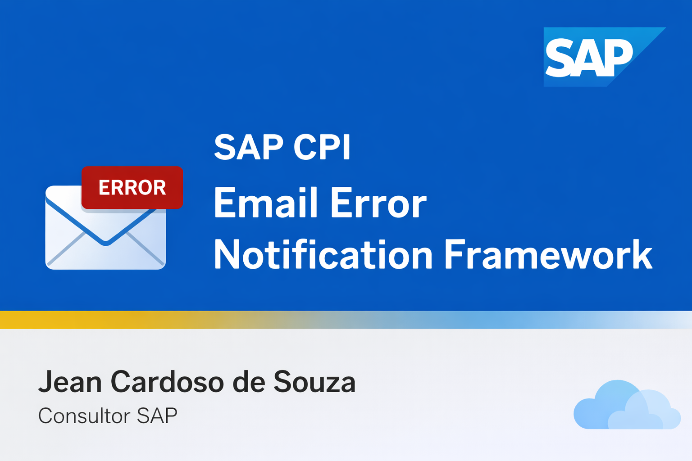


Este projeto demonstra a implementação de um iFlow no SAP Cloud Integration (CPI) para envio automático de notificações de erro por e-mail.


## 📌 Objetivo

Automatizar o monitoramento de falhas em integrações, notificando rapidamente a equipe responsável com informações relevantes para análise e reprocessamento.

---

## ✉️ Funcionalidades

- Envio automático de e-mail em caso de erro
- Template HTML com visual baseado no SAP Fiori
- Informações dinâmicas:
  - CPI Tenant
  - Nome do iFlow
  - Data/Hora
  - Message ID
- Mensagem amigável para time funcional + técnico
- Estrutura compatível com Outlook e clientes de e-mail

---

## 🎨 Layout

O e-mail segue boas práticas de compatibilidade:

- Uso de tabelas (email-friendly)
- Estilo inline (evita quebra no Outlook)
- Destaque visual para status de erro
- Organização em formato de "card" (inspirado no SAP Fiori)

---

## 🛠 Tecnologias utilizadas

- SAP Integration Suite (CPI)
- Content Modifier
- SMTP Adapter
- HTML (Email Template)

---

## 📊 Benefícios

- Redução do tempo de resposta a falhas
- Melhor visibilidade operacional
- Padronização de notificações
- Apoio ao suporte e operação

---


---


# :building_construction: Arquitetura do iFlow

### :one: O fluxo foi desenvolvido no SAP Cloud Integration (CPI) seguindo as etapas abaixo.

### Criando nosso Iflow
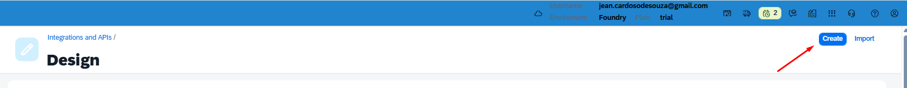
<br><br>

### Criando o Integration Flow
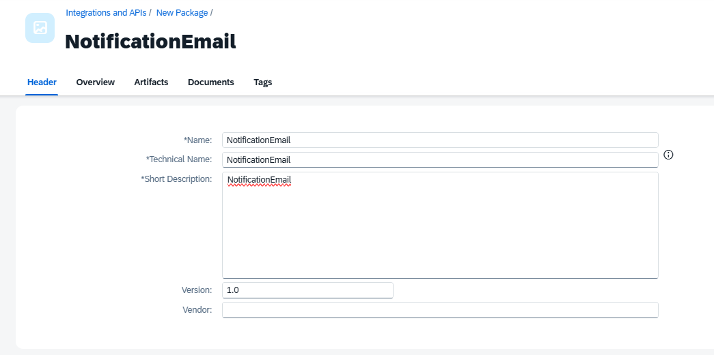
```
Address: /NotificationEmail
```
<br>

### Adicionando o Artefato do Integration Flow
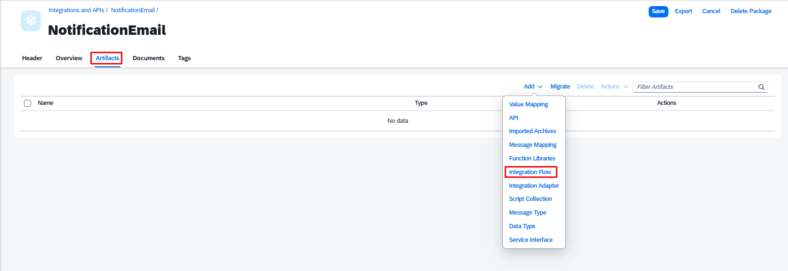

<br>

### Criando o Integration Flow
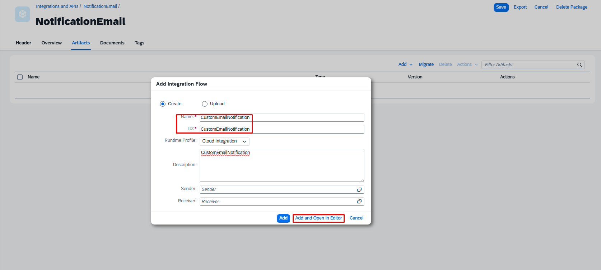
```
CustomEmailNotification
```

<br>
:gear: Etapas da Integração

<br>

### :two:  Manage Security

Criando nosso usuário para enviar o E-Mail
### Security Material
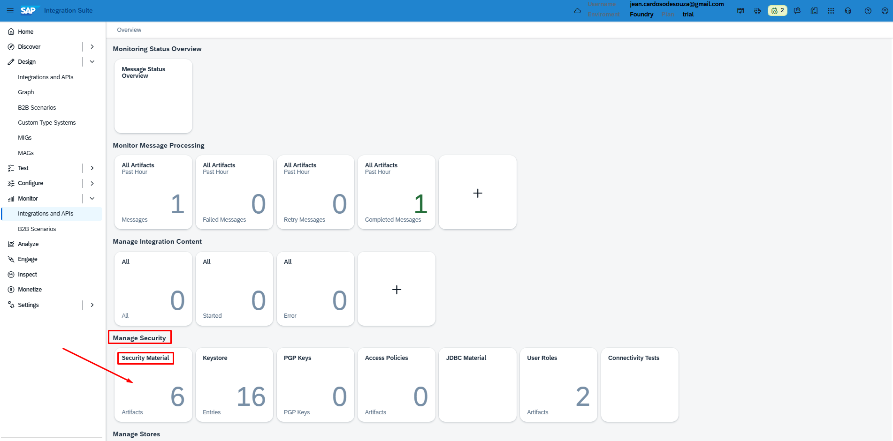

<br>

### Criando Credentials
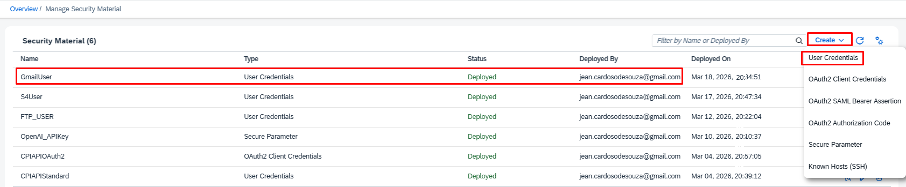

<br>

### Editando Credentials
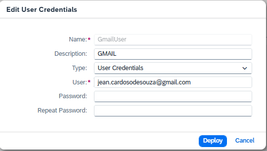
```
GmailUser
```
<br>

### :three:  Configuração Google Gmail
### Acessar ao Site
```
https://myaccount.google.com/apppasswords
```
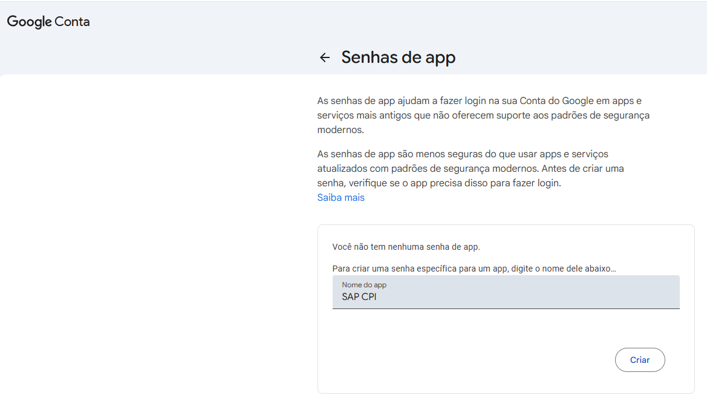
```
SAP CPI
```
<br>

### Armarzenar a senha
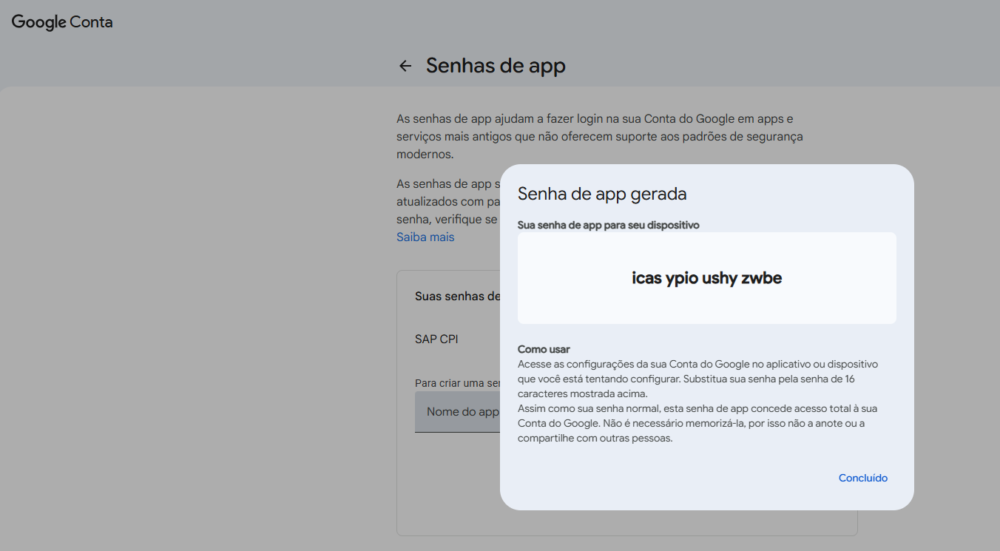

<br>

### Adicionar a senha nas Credentials
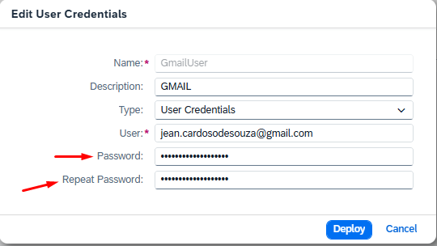

<br>

### Editando nosso Iflow
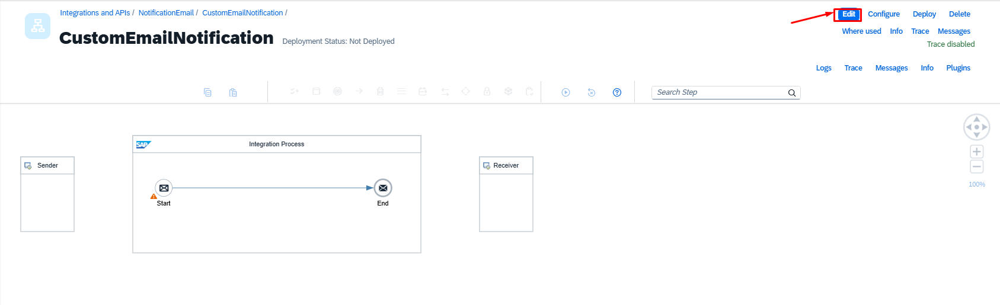

<br>

### :four:  HTTPS Sender

<br>

### Adicionando o HTTPS
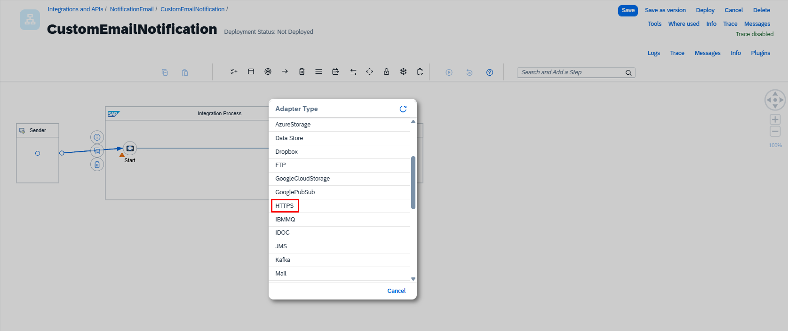

<br>

### Configurando o Endpoint
O fluxo é iniciado através de um endpoint HTTPS, permitindo que aplicações externas consultem o serviço.

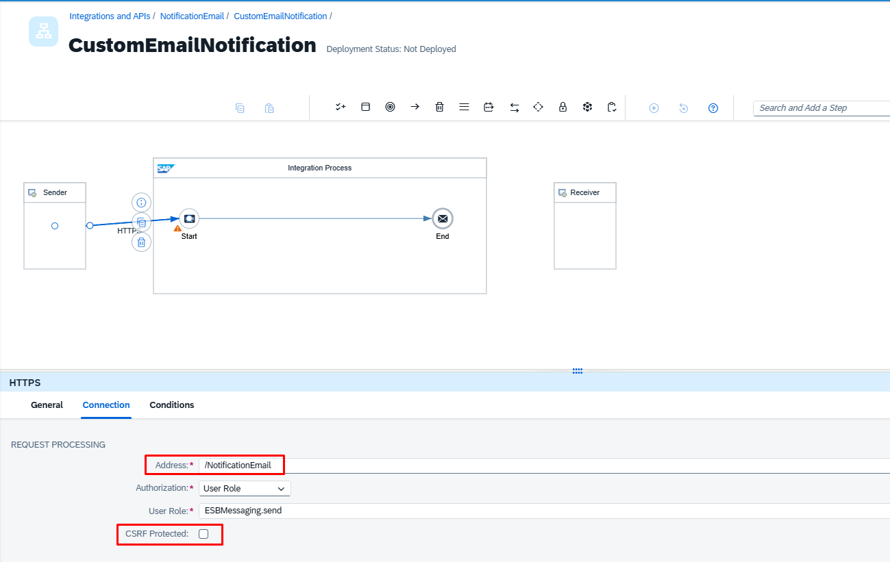

```
/NotificationEmail
```
<br>

### :five: Content Modifier – Definição  Prepare Email Payload

Nesta etapa são definidas as configurações que vamos usar para o Pauload.


### Adicionando o Content Modifier
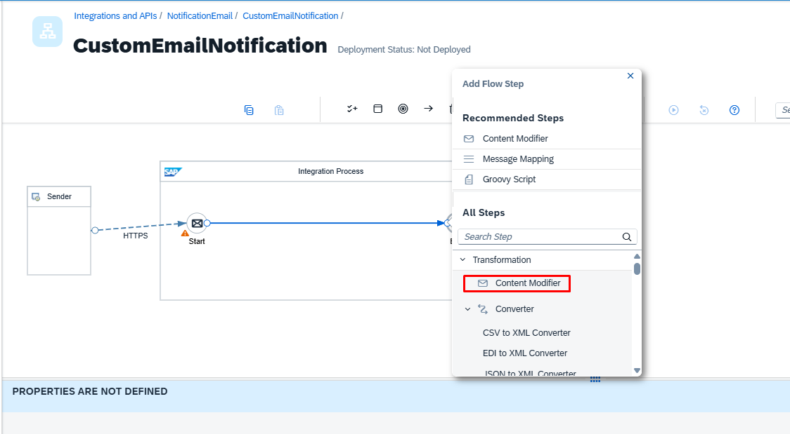

<br>

### Renomeando o Content Modifier
Renomeamos o Content Modifier 

```
Prepare Email Payload
```
<br>

### Configurando o Content Modifier - Property
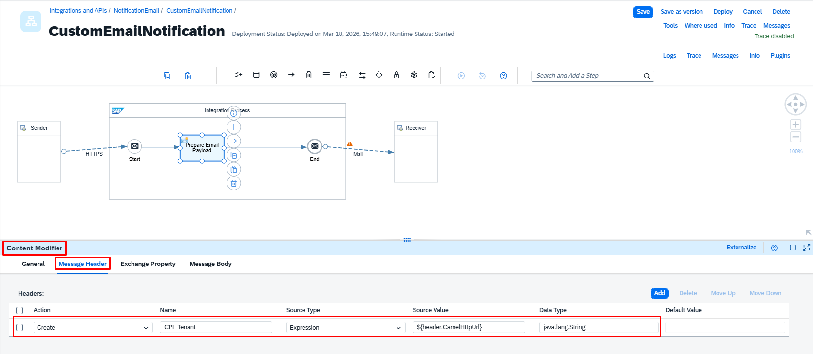

Em Property adicionamos
```
Exchange Property
create   -   Iflow_Name   -    Expression   -    ${property.Iflow_Name}             - java.lang.String
create   -   CPI_Tenant   -    Expression   -    ${property.CamelHttpHost}          - java.lang.String
create   -   Date_Now     -    Expression   -    ${date:now:yyyy-MM-dd HH:mm:ss}    - java.lang.String
```
<br>

### :six: End – Receiver

Nesta etapa, vamos utilizar o adapter de Email para que possamos realizar as conexões e configurações no adapter, para recebermos o e-mail da forma que queremos.

O retorno é recebido no formato HTML.

### Adicionamos o Adapter Mail
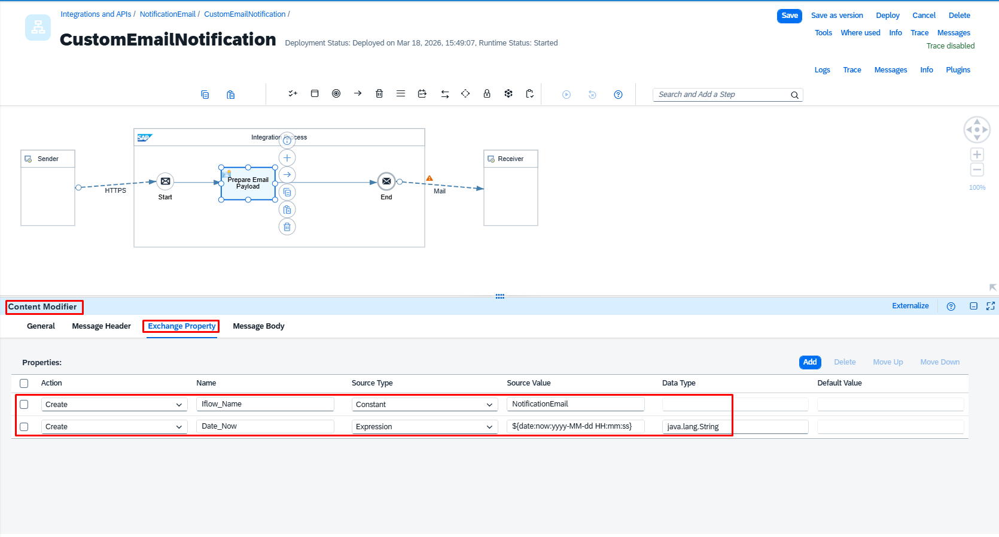

<br>

### Configuração do Mail - Connection
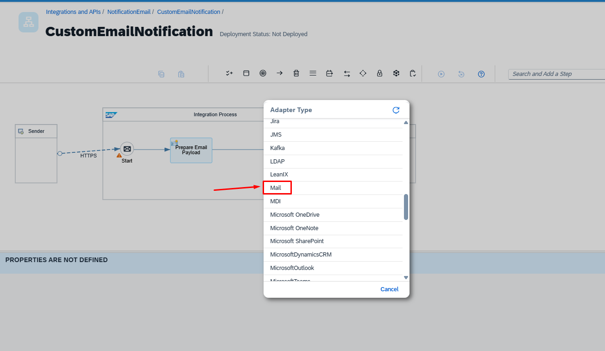
```
Address: smtp.gmail.com
Protection: SMTPS
Authentication: Plain User/Password
```
<br>

### Configuração do Mail - Processing
Vamos marcar Body Mime Type: Text/HTML
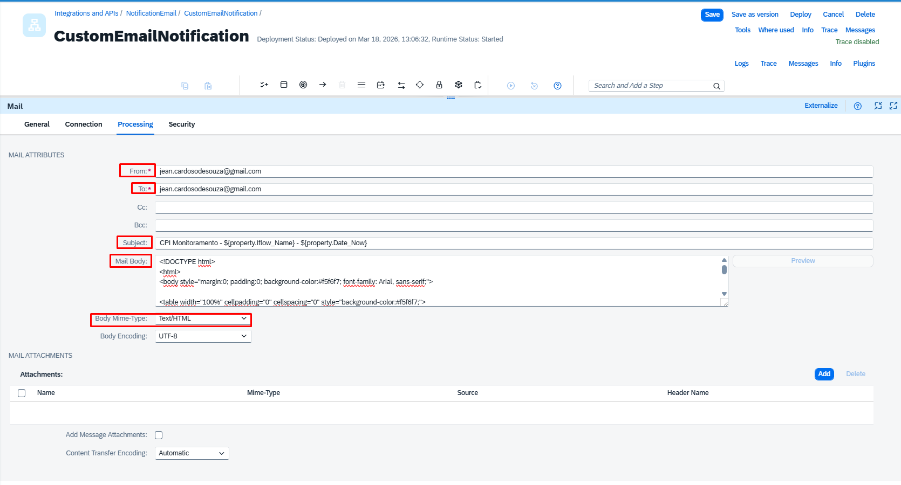

```
Subject: CPI Monitoramento - ${property.Iflow_Name} - ${property.Date_Now}
```
<br>

<br>

Mail Body:
```
<!DOCTYPE html>
<html>
<body style="margin:0; padding:0; background-color:#f5f6f7; font-family: Arial, sans-serif;">

<table width="100%" cellpadding="0" cellspacing="0" style="background-color:#f5f6f7;">
  <tr>
    <td align="center">

      <!-- CONTAINER -->
      <table width="600" cellpadding="0" cellspacing="0" style="background-color:#ffffff; border:1px solid #d9d9d9;">

        <!-- HEADER FIORI -->
        <tr>
          <td style="background-color:#0a6ed1; color:#ffffff; padding:20px; font-size:20px; font-weight:bold;">
            SAP CPI - Monitoramento
          </td>
        </tr>

        <!-- STATUS -->
        <tr>
          <td style="padding:20px;">
            <span style="background-color:#bb0000; color:#ffffff; padding:6px 12px; font-size:12px; border-radius:4px;">
              ERRO
            </span>
          </td>
        </tr>

        <!-- CONTEÚDO -->
        <tr>
          <td style="padding:0 20px 20px 20px; color:#32363a;">

            <h2 style="margin:0 0 10px 0; font-size:20px; color:#32363a;">
              Falha no iFlow
            </h2>

            <p style="font-size:14px; line-height:20px;">
              Olá,<br><br>
              Ocorreu um erro no fluxo de integração do SAP CPI. Veja os detalhes abaixo:
            </p>

            <!-- CARD ESTILO FIORI -->
            <table width="100%" cellpadding="10" cellspacing="0" style="border:1px solid #e5e5e5; border-radius:4px;">
              
              <tr style="background-color:#fafafa;">
                <td width="40%"><b>CPI Tenant</b></td>
                <td>${property.CPI_Tenant}</td>
              </tr>

              <tr>
                <td><b>Name Iflow</b></td>
                <td>${property.Iflow_Name}</td>
              </tr>

              <tr style="background-color:#fafafa;">
                <td><b>Date Time</b></td>
                <td>${property.Date_Now}</td>
              </tr>

              <tr>
  		<td><b>Erro</b></td>
  		<td style="color:#bb0000;">
  		Falha detectada durante a execução do fluxo de integração.<br/>
  		Acesse o SAP CPI em <b>Monitoramento → Message Monitoring</b> para análise detalhada e reprocessamento.
		</td>
	      </tr>

            </table>

            <p style="margin-top:20px; font-size:14px;">
              Verifique o monitoramento do CPI ou acione o time responsável.
            </p>

          </td>
        </tr>

        <!-- FOOTER -->
        <tr>
          <td style="background-color:#f5f6f7; padding:15px; font-size:12px; color:#6a6d70; text-align:center;">
            SAP Integration Suite © Empresa
          </td>
        </tr>

      </table>

    </td>
  </tr>
</table>

</body>
</html>
```

<br>


<br>
<br>
<br>
<br>
<br>
<br>
<br>
<br>
<br>
<br>
<br>
<br>


### :five: JSON → XML Converter

Como o SAP CPI trabalha melhor com XML em expressões XPath, o JSON retornado pela API é convertido para XML.

Exemplo simplificado do XML gerado:
```
<root>
   <current_weather>
      <temperature>22.5</temperature>
      <weathercode>3</weathercode>
   </current_weather>
</root>
```

<br>

### Adicionando o JSON → XML Converter


<br>

### Configurando o JSON → XML Converter
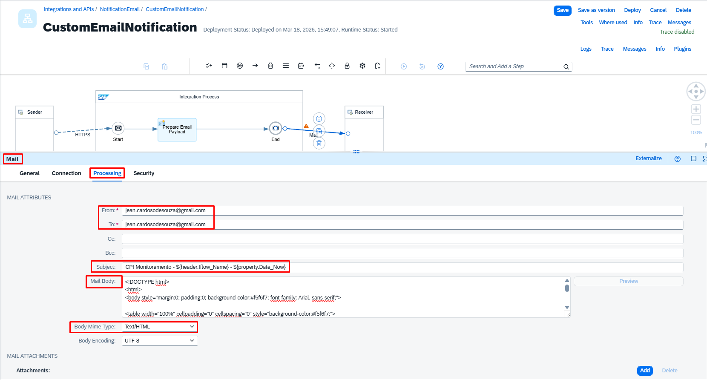
Em Processing
```
Add XML Root Element
Name: root
```

<br>

### :six: Router – Classificação Inteligente do Clima

O Router analisa os dados recebidos e classifica o clima em diferentes cenários com base em:

weathercode

temperatura

Exemplos de regras implementadas:

☀️ Sol agradável weathercode = 0 temperature > 15 temperature <= 25 <br>
🌥 Nublado frio weathercode = 3 temperature <= 15 <br>
🌫 Névoa weathercode = 45 ou 48 <br>
❄ Neve weathercode entre 71 e 86 <br>
🌧 Chuva weathercode entre 51 e 82 <br>

Cada condição também considera faixas de temperatura:

Status	Temperatura <br>
FRIO	≤ 15°C <br>
AGRADÁVEL	15°C – 25°C <br>
QUENTE	≥ 25°C <br>

### Adicionamos o Router


<br>

### Definindo a Route 1 Default
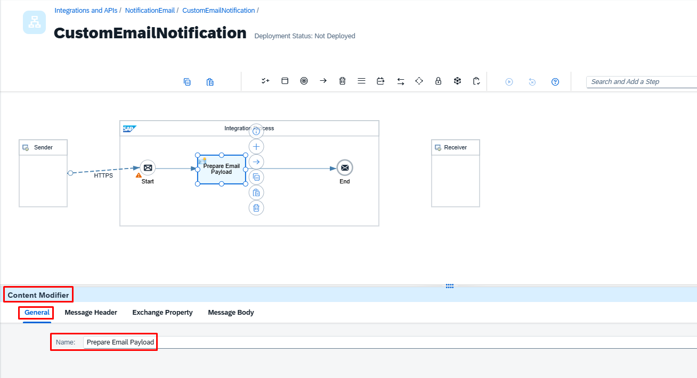

<br>

### :seven:  Content Modifier – Status	Erro


Quando houver erro na temperatura, o mesmo vai retornar um XML
### Adicionando o Content Modifier


<br>

### Configurando o Body 

```
Type: Constant
```

```
Body:
<Response>
    <message> Erro na temperatura</message>
</Response>
```

<br>

### :eight: Content Modifier

<br>

### Adicionar Content Modifier


Vamos renomear cada Content Modifiy

<br>

### Configurando o Property Content Modifier

```
Content Modifier - NevoaAGRADAVEL
Exchange Property
Create - statustemperature - Constant - AGRADAVEL
Create - temperature - XPath - /root/current_weather/temperature - java.lang.String
```

<br>

### Configurando o Body Content Modifier

Cada cenário gera uma mensagem específica para o sistema de logística.

📦 Exemplo de Resposta da Integração

```
<Response>
    <weather>CLOUDY</weather>
    <city>São Paulo</city>
    <message>Céu nublado com temperatura confortável. Clima estável.</message>
    <temperature>22.3</temperature>
    <status>AGRADAVEL</status>
</Response>
```


```
Message Body
Type: Expression
Body: 
<Response>
    <weather>CLOUDY</weather>
    <city>São Paulo</city>
    <message>Névoa leve com temperatura moderada. Atenção à visibilidade.</message>
    <temperature>${property.temperature}</temperature>
    <status>${property.statustemperature}</status>
</Response>
```
<br>

### Adicionando as Rotas
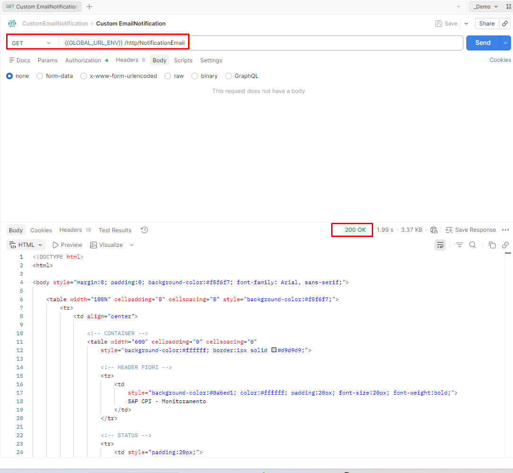
Adicionando as rotas quando for FRIO, QUENTE ou AGRADAVEL

```


<br><br>

## 📦 Exemplo prático – iFlow para baixar

📦 [Download do iFlow – Integracao-de-Clima](https://github.com/souzajean/Integracao-de-Clima/raw/main/Package/Weather-Condition-Integration.zip)


> O arquivo pode ser importado diretamente no SAP Integration Suite (CPI).
